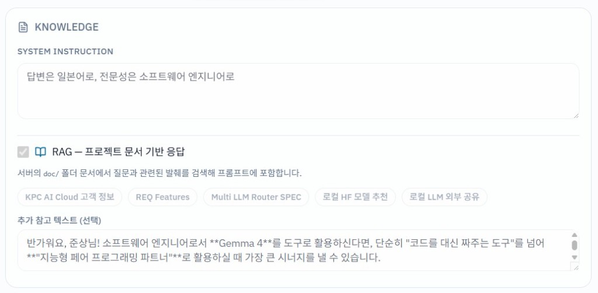
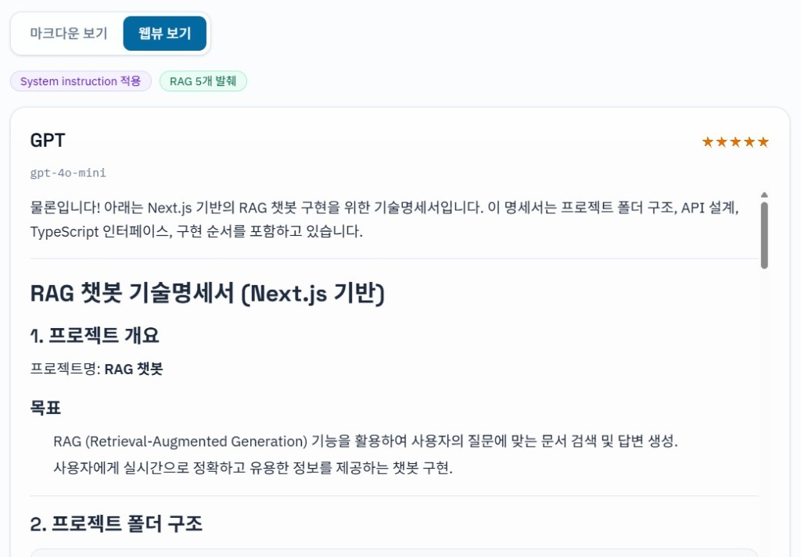
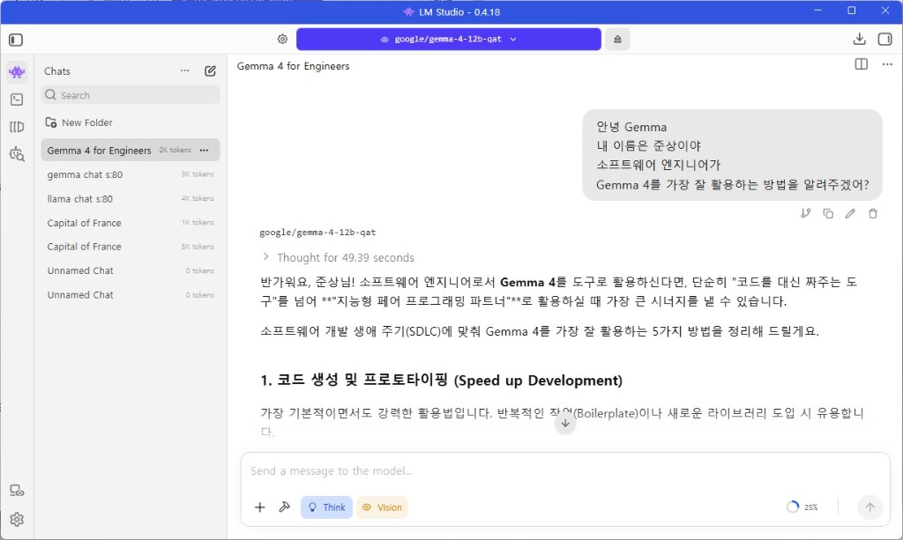

# Multi LLM Playground







**Goorm AI Gateway** — 하나의 UI에서 GPT, Gemini, Claude, Perplexity, **Local(LM Studio)** 를 선택·비교하거나, AUTO 모드로 멀티 LLM이 협의해 최적 모델에 응답을 맡기는 AI Gateway 학습용 앱입니다. **Knowledge** 패널에서 **System instruction**과 **RAG(프로젝트 `doc/` 문서)** 를 설정할 수 있습니다. **미로그인 방문자**는 Chat·Compare·AUTO 합산 **3회 무료 체험** 후, **Google 로그인 + 바우처**로 무제한 사용할 수 있습니다.

## 기술 스택

- Frontend: React + Vite + TypeScript + Tailwind CSS + Lucide + react-markdown + **Firebase Auth**
- Backend: Vercel Serverless Functions (`/api/chat`, `/api/compare`, `/api/auto`, `/api/rag/documents`)
- Provider Adapter: 공통 인터페이스로 **5개** LLM 추상화 (GPT · Gemini · Claude · Perplexity · **Local**)
- Local LLM: [LM Studio](https://lmstudio.ai/) OpenAI 호환 API (`http://localhost:1234/v1`)
- Knowledge: System instruction + 서버측 RAG(키워드 청크 검색, `doc/` 화이트리스트)
- Local Dev: Vite 미들웨어로 `/api`를 동일 포트에서 처리
- Client Storage: `sessionStorage`(바우처), `localStorage`(히스토리·사이드바·방문자 체험·Knowledge 설정)

## 시작하기

```bash
npm install
cp .env.example .env
# .env에 API 키·바우처·Firebase(Web) 설정 입력
```

### 로컬 실행 (권장)

```bash
npm run dev
# 또는 특정 포트
npm run dev -- --port 5191
```

기본 주소: **http://localhost:5181/** (`vite.config.ts`의 `strictPort`)

Vite가 UI와 `/api/chat`, `/api/compare`, `/api/auto`를 함께 제공합니다.

### Vercel CLI로 API 실행 (선택)

```bash
npm run dev:full
# 또는
npx vercel dev --listen 3000
```

## 환경 변수

서버 전용 (브라우저에 노출되지 않음):

```
OPENAI_API_KEY=
GOOGLE_API_KEY=
ANTHROPIC_API_KEY=
PERPLEXITY_API_KEY=
VOUCHER_CODE=
LM_STUDIO_BASE_URL=http://localhost:1234
```

클라이언트 (Vite `VITE_` prefix):

```
VITE_VOUCHER_CODE=
VITE_FIREBASE_API_KEY=
VITE_FIREBASE_AUTH_DOMAIN=
VITE_FIREBASE_PROJECT_ID=
VITE_FIREBASE_STORAGE_BUCKET=
VITE_FIREBASE_MESSAGING_SENDER_ID=
VITE_FIREBASE_APP_ID=
```

Firebase 프로젝트 예: `goorm-vibe-login` · 웹앱 `next-multi-llm`. [Firebase Console](https://console.firebase.google.com/)에서 **Authentication → Sign-in method → Google** 활성화 및 **Authorized domains**에 `localhost`와 배포 도메인을 등록하세요. `firebase deploy`는 Hosting용이며 Vercel 배포 시 Auth만으로 동작합니다.

키가 없는 provider는 해당 요청만 에러를 반환하고, Compare·AUTO 모드에서는 나머지 모델로 계속 진행합니다.

## 인증 (방문자 체험 · Google + 바우처)

### 방문자 (미로그인)

- Chat · Compare · AUTO **성공 1회당** 체험 1회 차감, **합산 최대 3회** (`localStorage` 키 `multi-llm-guest-trial-used`)
- 체험 중 API는 클라이언트가 `VITE_VOUCHER_CODE`를 body에 실어 호출합니다 (서버 검증은 기존과 동일, **서버 측 체험 횟수 제한은 없음**)
- 3회 소진 후: Google 로그인 → 바우처 입력으로 무제한 사용
- 체험 횟수는 **브라우저·기기별**이며 시크릿 창·다른 기기에서는 별도 카운트입니다 (교육용 MVP)

### 로그인 사용자

프롬프트 실행 전 **Google 로그인**과 **바우처 코드**가 **모두** 필요합니다.

1. **Google**: Firebase Auth `signInWithPopup` (클라이언트)
2. **바우처**: `sessionStorage` + API body `voucher`
3. **실행 가능**: Google 세션 O **AND** 바우처 O
4. **바우처 잠금**: 바우처만 해제 (Google 세션 유지)
5. **Google 로그아웃** (Settings): Firebase signOut + 바우처 삭제

API는 서버 [`api/_lib/voucher.ts`](api/_lib/voucher.ts) 검증을 유지합니다 (Firebase ID 토큰 서버 검증은 범위 외).

## 바우처 (API)

서버는 요청 body의 `voucher`가 `VOUCHER_CODE`와 일치하는지 확인합니다. 클라이언트 UI 게이트와 별개로, 직접 API 호출 시에도 동일 코드가 필요합니다.

## 주요 기능

### Chat / Compare / AUTO

- **Chat**: provider + 모델 Select 후 단일 호출
- **Compare**: 4 provider 병렬, 속도·토큰·비용·품질 비교
- **AUTO**: 멀티 LLM 협의 라우팅 후 최적 모델이 최종 응답

### Knowledge (System instruction · RAG)

- **System instruction**: 역할·언어·형식 등 지시 (`localStorage` 키 `multi-llm-system-instruction`)
- **RAG**: `doc/` 화이트리스트 문서에서 질문 관련 발췌를 검색해 프롬프트에 포함 (`GET /api/rag/documents`)
- Chat · Compare · AUTO 요청 body에 `systemInstruction`, `rag` 전달 가능
- 응답 `knowledge` 메타: System instruction / RAG 발췌 개수 배지 표시

### Local LLM (LM Studio)

- Model 목록 **Local** — 기본 모델 `gemma-4-12b-qat` (LM Studio에 로드된 모델 id와 일치해야 함)
- LM Studio Local Server 실행 (`localhost:1234`) 필요
- **앱 시작 시** `GET /api/local/status`로 연결·모델 로드 여부를 확인. 사용 불가면 **Local 버튼 비활성**
- Vercel 배포 환경에서는 서버가 사용자 PC의 `localhost`에 닿지 않으므로, 터널 URL을 `LM_STUDIO_BASE_URL`에 넣지 않으면 Local은 비활성됩니다
- 외부 공유 방법: [doc/로컬 LLM 외부 공유 방법.md](doc/%EB%A1%9C%EC%BB%AC%20LLM%20%EC%99%B8%EB%B6%80%20%EA%B3%B5%EC%9C%A0%20%EB%B0%A9%EB%B2%95.md)

### GPT 스타일 접이식 사이드바

- 좌측 **Chat · Compare · Auto · Settings · About** + **History**
- **패널 토글 버튼**(둥근 사각형 + 세로 구분선): 사이드바 열림 시 패널 우측 상단, 닫힘 시 본문 상단에서 열기
- 데스크톱: 너비 애니메이션으로 본문과 함께 레이아웃 / 모바일: 오버레이 드로어
- 열림 상태: `localStorage` 키 `multi-llm-sidebar-open`

### 질문·답변 히스토리

- 성공한 요청을 `multi-llm-playground-history`에 저장 (최대 50건)
- History 클릭 → 프롬프트·모델·답변 **재호출 없이** 복원
- Settings에서 전체 삭제

### Provider별 모델 Select

Chat에서 provider별 드롭다운 (GPT `gpt-4o`/`gpt-5`, Claude Haiku/Sonnet/Opus, Gemini Flash/Pro, Sonar/Sonar Pro). `/api/chat` body의 `model`로 전달. Compare·AUTO는 기본 모델.

### Prompt 예시 뱃지 · 응답 보기

- 5종 예시 뱃지 (기본: **모델의 자기인식**)
- **마크다운 보기** / **웹뷰 보기** (`react-markdown` GFM)

## API

### `POST /api/chat`

```json
{
  "provider": "gpt",
  "model": "gpt-4o",
  "prompt": "Explain MCP",
  "voucher": "<VOUCHER_CODE>",
  "systemInstruction": "답변은 일본어로 작성하세요.",
  "rag": {
    "enabled": true,
    "documentIds": ["req-features", "kpc-customers"],
    "supplementalText": "선택: 추가 참고 텍스트",
    "topK": 5
  }
}
```

### `GET /api/local/status`

LM Studio(`/v1/models`) 연결 가능 여부와 로드된 모델 목록. UI에서 Local 버튼 활성/비활성에 사용.

### `GET /api/rag/documents`

RAG에 사용 가능한 `doc/` 문서 메타(id, title) 목록.

### `POST /api/compare` · `POST /api/auto`

Compare는 4 provider 병렬. AUTO는 Council 표결 + 최종 응답 및 `orchestration` 메타데이터.

## 기본 모델 (Compare / AUTO)

| Provider   | Model              |
| ---------- | ------------------ |
| GPT        | `gpt-4o-mini`      |
| Gemini     | `gemini-2.5-flash` |
| Claude     | `claude-haiku-4-5` |
| Perplexity | `sonar`            |
| Local      | `gemma-4-12b-qat`  |


## 변경 이력 (최근)

### 이번 작업 — Local LLM 가용성 검사 · Local 버튼 비활성

#### 주요 내용

- **앱 시작 시 Local 평가**: `GET /api/local/status` → LM Studio `/v1/models` 프로브 (타임아웃 2.5초)
- **Local 버튼 비활성**: 연결 실패·모델 미로드 시 Model 선택에서 Local을 비활성하고 「사용 불가」 표시
- 비활성 상태에서 Local이 선택되어 있으면 GPT로 자동 전환 (히스토리 복원 시에도 동일)
- README·배포 안내: Vercel에서는 `localhost` Local이 기본 불가, 터널 URL 필요 시 `LM_STUDIO_BASE_URL` 사용

#### 오류·UX 보완

- Local 선택 불가 시 안내 문구로 LM Studio Local Server 실행·새로고침 유도
- 상태 확인 중에는 Local 카드에 「확인 중…」 표시

### 이전 작업 — Local LLM · Knowledge(RAG) · 안정화

#### 주요 내용

- **Local provider**: LM Studio OpenAI 호환 API (`api/_lib/providers/local.ts`), Model 선택 **Local** · `gemma-4-12b-qat`
- **Knowledge UI**: `KnowledgePanel` — System instruction, RAG 문서 다중 선택, 추가 참고 텍스트
- **서버 RAG**: `api/_lib/rag.ts` — `doc/` 화이트리스트, 키워드 기반 청크 검색, Chat/Compare/AUTO 공통 `prepareChat`
- **System instruction**: 모든 provider adapter에 `system` 역할 전달
- **API**: `GET /api/rag/documents`, chat/compare/auto body 확장 (`systemInstruction`, `rag`)
- **문서**: Firebase 설정 템플릿, 로컬 HF 모델 추천, 로컬 LLM 외부 공유(ngrok/Cloudflare) 가이드

#### 오류·UX 보완

- **`useLocalStorage` 무한 렌더**: `initialValue` 참조 변경으로 `useEffect` 루프 → lazy init + `useRef`로 수정
- **System instruction 미반영(RAG 사용 시)**: 긴 RAG user 블록이 system 지시를 압도 → `systemPrompt.ts`로 system 강화 + user 메시지 하단 `[System instruction — mandatory]` 재주입, RAG 안내 문구 중립화

### 이전 작업 — Google 로그인 · 방문자 무료 체험 3회

#### 주요 내용

- **Firebase Google 로그인**: `src/lib/firebase.ts`(env 기반 초기화), `AuthContext` + `main.tsx`의 `AuthProvider`, `signInWithPopup` / `signOut`
- **AccessGate 통합**: 미로그인·로그인·바우처 상태별 UI — Google 프로필, 바우처 입력, 녹색 인증 완료 배너, 바우처 잠금
- **실행 조건**: `unlocked`(Google **AND** 바우처) 또는 방문자 `canExecute`(체험 잔여 > 0); `PromptInput` / `ModelSelector`는 `canExecute` 기준
- **방문자 무료 체험 3회**: `src/services/guestTrial.ts` — 키 `multi-llm-guest-trial-used`, Chat·Compare·AUTO **성공 1회당** 1회 차감
- **체험 중 API**: `api.ts`의 `getVoucherForRequest({ guestTrial: true })` → `VITE_VOUCHER_CODE` (서버 `voucher.ts` 변경 없음)
- **AccessGate 체험 UI**: 잔여 `N/3` sky 배너 + Google 로그인(선택); 3회 소진 시 Google 로그인 필수 안내
- **Settings**: Google 계정·바우처 상태, 방문자 체험 사용량·초기화(교육·디버그), Google 로그아웃 시 바우처 삭제
- **`.env.example`**: `VITE_FIREBASE_*` 항목 추가 (Analytics 미사용)

#### 오류·UX 보완

- **API 실패 시 체험 미차감**: `recordGuestTrialUse()`는 `handleSubmit` 성공 분기에서만 호출
- **authLoading** 동안 프롬프트 제출·체험 판정 지연 (로딩 중 잘못된 게이트 방지)
- 체험 배너 잔여 횟수: `guestTrialTick` + `useMemo`로 성공 직후 UI 즉시 갱신
- Firebase env 누락 시 Google 버튼 비활성 + 안내 (초기화 실패로 앱 크래시 방지)
- Google 팝업 차단·취소·기타 Auth 오류 한국어 메시지 (`AuthContext`)
- 체험 소진 방문자: 입력·모델 UI `locked` / `disabled`로 제출 차단
- 로그인+바우처 사용자는 체험 localStorage와 무관하게 무제한 실행

### 이전 릴리스 요약

- **접이식 사이드바 UI**: ChatGPT 유사 레이아웃, `AppShell`, 패널 토글, History
- **REQ Features** ([doc/REQ Features.md](doc/REQ%20Features.md)): 히스토리, provider별 모델 Select, Settings/About
- **AUTO 오케스트레이션**: `/api/auto`, 협의 요약 UI
- **응답 보기**: 마크다운 / 웹뷰 전환 · **Prompt 예시 뱃지** 5종 · Goorm 브랜딩
- 서버 `/api/*` 바우처 검증 (`401`), AUTO Council provider별 실패 겹리, 히스토리 복원 시 모델 id 검증

## 배포

Vercel에 연결 후 Environment Variables에 API 키와 `VOUCHER_CODE`를 등록합니다.

- Private: [junsang-dong/next-llm-playground](https://github.com/junsang-dong/next-llm-playground)
- Public (교육용): [junsang-dong/goorm-260727-multi-llm](https://github.com/junsang-dong/goorm-260727-multi-llm)
