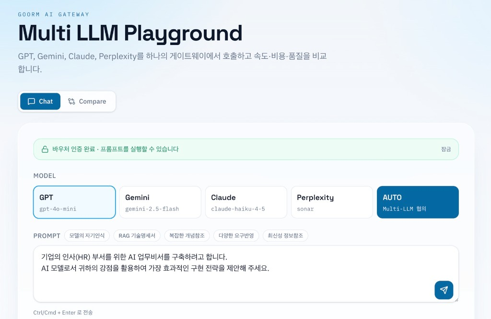

# Multi LLM Playground



**Goorm AI Gateway** — 하나의 UI에서 GPT, Gemini, Claude, Perplexity를 선택·비교하거나, AUTO 모드로 멀티 LLM이 협의해 최적 모델에 응답을 맡기는 AI Gateway 학습용 앱입니다.

## 기술 스택

- Frontend: React + Vite + TypeScript + Tailwind CSS + Lucide + react-markdown
- Backend: Vercel Serverless Functions (`/api/chat`, `/api/compare`, `/api/auto`)
- Provider Adapter: 공통 인터페이스로 4개 LLM 추상화
- Local Dev: Vite 미들웨어로 `/api`를 동일 포트에서 처리

## 시작하기

```bash
npm install
cp .env.example .env
# .env에 API 키·바우처 코드 입력
```

### 로컬 실행 (권장)

```bash
npm run dev
# 또는 특정 포트
npm run dev -- --port 5191
```

기본 주소: **http://localhost:5181/** (`vite.config.ts`의 `strictPort`)

Vite가 UI와 `/api/chat`, `/api/compare`, `/api/auto`를 함께 제공합니다.

### Vercel CLI로 API 실행 (선택)

```bash
npm run dev:full
# 또는
npx vercel dev --listen 3000
```

## 환경 변수

서버 전용 (브라우저에 노출되지 않음):

```
OPENAI_API_KEY=
GOOGLE_API_KEY=
ANTHROPIC_API_KEY=
PERPLEXITY_API_KEY=
VOUCHER_CODE=
```

클라이언트 인증 UI용 (Vite `VITE_` prefix):

```
VITE_VOUCHER_CODE=
```

키가 없는 provider는 해당 요청만 에러를 반환하고, Compare·AUTO 모드에서는 나머지 모델로 계속 진행합니다.

## 바우처 인증

프롬프트 실행 전 바우처 코드 인증이 필요합니다.

- UI: 상단 Voucher 입력란에서 코드 인증 → 잠금 해제 후 Chat/Compare 실행 가능
- API: `voucher` 필드가 없거나 `VOUCHER_CODE`와 불일치하면 `401` 반환
- 세션: 인증 상태는 `sessionStorage`에 유지되며, 「잠금」으로 해제 가능

바우처 코드는 `.env`의 `VOUCHER_CODE` / `VITE_VOUCHER_CODE`에서 설정합니다.

## 주요 기능

### Chat / Compare

- **Chat**: 단일 모델 선택 후 호출
- **Compare**: 4개 provider 병렬 호출, 속도·토큰·추정 비용·품질 별점 비교

### AUTO 오케스트레이션

모델 선택 우측의 **AUTO** 버튼으로 멀티 LLM 협의 모드를 사용합니다.

1. 사용 가능한 provider에게 라우팅 의견을 병렬 질의
2. 다수결(동점 시 우선순위)로 최적 모델 선정
3. 선정된 모델로 사용자 질문에 최종 응답
4. UI에 협의 요약(투표·이유·협의 시간) 표시

### Prompt 예시 뱃지

Prompt 타이틀 옆에서 모델 특성 비교용 예시를 바로 넣을 수 있습니다.

- 모델의 자기인식 / RAG 기술명세서 / 복잡한 개념참조 / 다양한 요구반영 / 최신성 정보참조
- 기본값은 **모델의 자기인식**

### 응답 보기 모드

- **마크다운 보기**: 원문 그대로
- **웹뷰 보기**: Markdown을 HTML로 렌더링 (제목·목록·코드·표 등)

## API

### `POST /api/chat`

```json
{ "provider": "gpt", "prompt": "Explain MCP", "voucher": "<VOUCHER_CODE>" }
```

### `POST /api/compare`

```json
{ "prompt": "Explain AI Agent.", "voucher": "<VOUCHER_CODE>" }
```

4개 provider를 병렬 호출하고 속도·토큰·추정 비용을 함께 반환합니다.

### `POST /api/auto`

```json
{ "prompt": "Explain AI Agent.", "voucher": "<VOUCHER_CODE>" }
```

Council 표결 후 선정된 provider의 최종 응답과 `orchestration`(votes, routingElapsed 등)을 반환합니다.

## 기본 모델

| Provider   | Model              |
| ---------- | ------------------ |
| GPT        | `gpt-4o-mini`      |
| Gemini     | `gemini-2.5-flash` |
| Claude     | `claude-haiku-4-5` |
| Perplexity | `sonar`            |


## 변경 이력 (최근)

### 주요 내용

- **브랜딩**: `Goorm AI Gateway` / `Multi LLM Playground`로 타이틀 변경
- **AUTO 오케스트레이션**: `/api/auto` + 멀티 LLM 협의 라우팅, Chat UI에 AUTO 버튼·협의 요약
- **응답 보기**: 마크다운 원문 / 웹뷰(렌더링) 전환 (`react-markdown`, GFM)
- **Prompt 예시 뱃지**: 5종 예시 질문, 기본값은「모델의 자기인식」
- **AUTO 버튼 스타일**: 선택 중인 Prompt 뱃지와 동일한 진한 파란(`accent-deep`)으로 구분
- **바우처 게이트**: 바우처 코드 인증 후에만 프롬프트 실행 가능
- **서버 검증**: `/api/chat`, `/api/compare`, `/api/auto`(Vercel + Vite 로컬)에서 바우처 필수 검증
- **로컬 포트**: 개발 서버 기본 포트 `5181` (`strictPort`), CLI로 `5191` 등 지정 가능

### 오류·보안 보완

- UI만 막는 방식으로는 API 직접 호출을 우회할 수 있어, 서버에서도 바우처를 검증하도록 수정
- 바우처 미입력·불일치 시 `401`과 안내 메시지로 명확히 거부
- 미인증 상태에서는 프롬프트/모델 선택 UI를 비활성화해 잘못된 요청을 줄임
- AUTO Council에서 개별 provider 실패는 격리하고, 키가 있는 모델만으로 표결·최종 호출
- 유효 표가 없거나 최종 모델 호출 실패 시 `502`와 안내 메시지로 실패 원인을 명확히 반환

## 배포

GitHub에 push한 뒤 Vercel에 연결하고, 프로젝트 Environment Variables에 API 키와 `VOUCHER_CODE`를 등록합니다.

리포지토리: [junsang-dong/goorm-260727-multi-llm](https://github.com/junsang-dong/goorm-260727-multi-llm)
